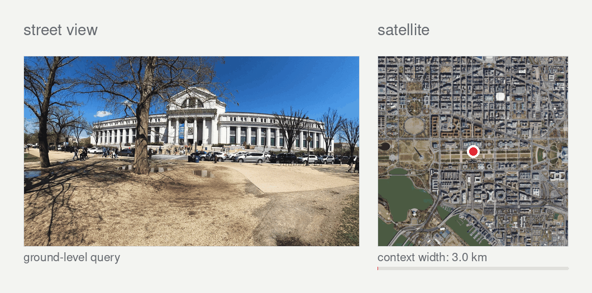

# Just Zoom In
[](https://arxiv.org/abs/2603.25686)
[](https://huggingface.co/datasets/pcvlab/justzoomin)
[](https://osupcvlab.github.io/just-zoom-in/)



Just Zoom In is a cross-view geo-localization framework that localizes a street-view image by autoregressively zooming into a city-scale satellite map. Instead of treating geo-localization as a retrieval problem over fixed satellite crops, the model performs sequential coarse-to-fine spatial reasoning: it starts from a broad overhead view and predicts a short sequence of zoom decisions until it reaches a terminal map cell at the target resolution.

This repository contains the training, evaluation, and visualization code for Just Zoom In, including teacher-forced training, autoregressive validation, checkpoint evaluation, and qualitative visualization of predicted zoom sequences.


## Environment

This repo uses `uv` and Python 3.11.

```bash
curl -LsSf https://astral.sh/uv/install.sh | sh
uv sync --locked
```

Run scripts with:

```bash
uv run python train.py
```

Or activate the environment:

```bash
source .venv/bin/activate
python train.py
```

The lockfile pins the CUDA 12.1 PyTorch wheels. If you need a different CUDA or CPU-only environment, update `pyproject.toml`, run `uv lock`, then `uv sync --locked`.

## Dataset Configuration

Download the dataset from Hugging Face:

https://huggingface.co/datasets/pcvlab/justzoomin

Follow the dataset instructions there. After download/extraction, the expected local layout is:

```text
justzoomin_data/
  satellite/
    0/
    -1/
    ...
    layout.yaml
  streetview/
    images/
  metadata/
    large_area_train_map.csv
    large_area_val_map.csv
```

The metadata CSV files should contain at least:

```text
image_id,latitude,longitude,sequence
```

Set the correct dataset paths in:

```text
configs/base.py   # training data path
configs/eval.py   # validation/evaluation data path
```

Update `data_root` or the individual path fields before training or evaluation. The configs also define the model, zoom region, image size, batch size, and training schedule, so check them before launching runs.

## Training

Single GPU:

```bash
uv run python train.py
```

Multi-GPU with DDP:

```bash
uv run torchrun --nproc_per_node=4 train.py
```

Training writes checkpoints to:

```text
checkpoints/<generated_run_name>/
  best_model.pth
  epoch_<N>.pth
```

The trainer uses teacher-forced training and autoregressive validation. `best_model.pth` is selected by validation `r@40m`.

## Evaluation

Use `evaluate_checkpoints.py` for autoregressive checkpoint evaluation.

Set the constants at the top of the file:

```python
CHECKPOINT_DIR = Path("./checkpoints")
DEVICE = "cuda:0"
BATCH_SIZE = 64
```

Then run:

```bash
uv run python evaluate_checkpoints.py
```

The script evaluates every `.pth` file in `CHECKPOINT_DIR` and writes `evaluation_report.txt` into that folder. It reports strict sequence accuracy and final-distance metrics.

## Visualization

Use `visualize_checkpoint_sequences.py` to render random validation samples from a checkpoint.

Set the constants at the top of the file:

```python
CHECKPOINT_PATH = Path("./checkpoints/best_model.pth")
OUTPUT_DIR = Path("./dataset_visualizations/checkpoint_sequences")
DEVICE = "cuda:0"
NUM_SAMPLES = 10
```

Then run:

```bash
uv run python visualize_checkpoint_sequences.py
```

The script saves GT-vs-predicted zoom sequence panels and optional overview images.

## Files

```text
configs/
  base.py
  eval.py
data/
  dataset.py
  transforms.py
models/
  encoder.py
  decoder.py
  model.py
utils/
  logger.py
  utils.py
  visualization_utils.py
train.py
evaluate_checkpoints.py
visualize_checkpoint_sequences.py
pyproject.toml
uv.lock
```

## Cite
If you use this code or dataset, please cite:

```bibtex
@article{erzurumlu2026justzoomin,
  title={Just Zoom In: Cross-View Geo-Localization via Autoregressive Zooming},
  author={Erzurumlu, Yunus Talha and Kwag, Jiyong and Yilmaz, Alper},
  journal={arXiv preprint arXiv:2603.25686},
  year={2026},
  doi={10.48550/arXiv.2603.25686},
  eprint={2603.25686},
  archivePrefix={arXiv},
  primaryClass={cs.CV}
}
```